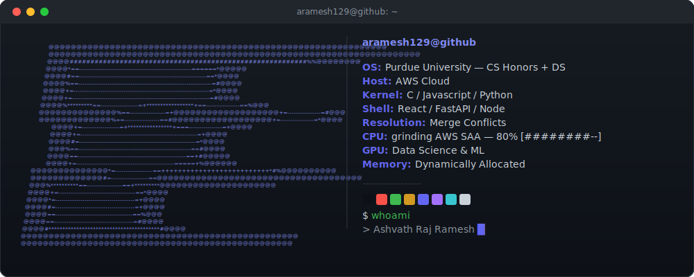

<!-- ============================================================
  Replace every occurrence of aramesh129 below with your
  actual GitHub username before you commit this file.
============================================================ -->

 

---

### areas of interest
- **Full Stack Development** 
- **Cloud & DevOps**
- **Data Science & ML** 

---

<picture>
  <source media="(prefers-color-scheme: dark)" srcset="https://raw.githubusercontent.com/aramesh129/aramesh129/output/github-contribution-grid-snake-dark.svg" />
  <source media="(prefers-color-scheme: light)" srcset="https://raw.githubusercontent.com/aramesh129/aramesh129/output/github-contribution-grid-snake.svg" />
  
</picture>

---

### the stats

  

---

### links

---

### quote of the day
<!-- QUOTE_START -->

"I can never decide whether my dreams are the result of my thoughts or my thoughts the result of my dreams."

— **D. H. Lawrence**

<!-- QUOTE_END -->

This profile updates itself daily using GitHub Actions

